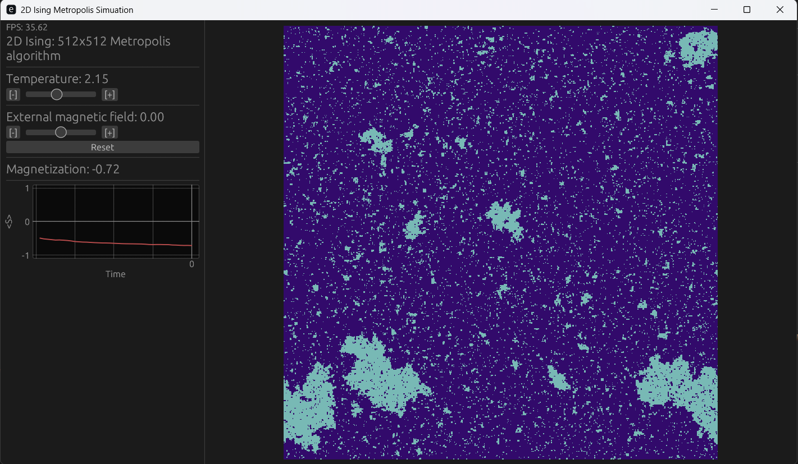

# 2d Ising Metropolis-Rosenbluth Simulation in Rust

Click the image to try out the interactive WebAssembly simulation!<br>
[](https://so-groenen.github.io/2d_ising_in_rust/)

### This Rust project contains 
1) **Real time 2D Ising Simulation**, which uses the Metropolis-[Rosenbluth](https://en.wikipedia.org/wiki/Arianna_W._Rosenbluth) algorithm to solve 
a $512\times512$ two level spin system in real time, and displays it live using [egui](https://github.com/emilk/egui) & [WebAssembly](https://en.wikipedia.org/wiki/WebAssembly) 
2) **Basic calculation of the phase diagram**, meaning: magnetization, energy density, specific heat, magnetic susceptibilities & correlation length. TODO: Adding proper estimation calculation/auto-correlation time (using Jackknife resampling)<br>

### Goals
The main goal of this project, was to learn more about Rust for: 
* Real time graphics/physics simulations,
* Generic programming (using the [num-traits](https://docs.rs/num-traits/latest/num_traits/) crate), 
* Low-level control of memory/data-structures: the spins are encoded as `i8` (1 byte signed ints), the observables (magnetization etc...) as `f32` for the real-time simulation, but `f64` for the phase diagram.
Being able to run a `perform_computation(...)` type function for both `f32` & `f64`, while maintaining type safety (*ie*, avoid implicit casting) was very important.
* Low-level implementations of random number generation (mainly XORshifts, following the guidlines/C implementations of [https://prng.di.unimi.it/](https://prng.di.unimi.it/))
* Multithreading using [Rayon](https://github.com/rayon-rs/rayon) for Monte-Carlo simulations (and possibly benchmark it against C/C++/FORTRAN libs like OpenMP, or Julia's [Polyester](https://github.com/JuliaSIMD/Polyester.jl)).
* Using Python to interact with high-performance/multithreaded Rust programs. (See [Python Simulation Manager](https://github.com/so-groenen/python_simulation_manager))

## Real Time Simulation

### You can:
* Change the temperature
* Change the external magnetic field
* Watch the magnetization change in the plot.
### What you can try out:

* Go to high temperatures, quickly lower the temperature to see clusters forming, and see the two spin types "fight".
* See how even at low temperatures, ie, temperature around 0.5 (in units of $J/k_B$) the net magnetization (the red line in the plot) takes a lot of time to move, and stays close to zero.
* Play around with the external field to stabilize the clusters of your choice & destroy the other ones
* See how long it takes to get the full screen of one color, while staying above temp = 0.
* See if you can generate "zero-temperature" artifacts, that is, clusters which survive at zero temperature. Indeed, flipping spins inside of these clusters actually raises their energy, and so these "artifacts" are
difficult to get rid of using single-spin algorithms.


## Monte-Carlo calculation in Rust 


Using the same data-structure, we can perform some calcuations for linear system sizes $L=[8, 16, 32, 64, 128]$, and total number of spins $N=L\times L$, using the Ising Hamiltonian:

$$
H_{ising} = -J \sum_{\langle i,j \rangle}s_is_j - h\sum_is_i,\qquad s_i \equiv s(\vec{r}_i) = \pm 1.
$$


Parameters used where:
* $5\times 10^5$ steps both for thermalization & for measurements for $L\in [8, 16, 32, 64]$
* $1\times 10^5$  steps both for thermalization & for measurements for $L=128$
* No external magnetic field: $h=0$
* Usual ferromagnetic interaction strength: $J=1$

Here, one step = one sweep across the lattice = $N=L\times L$ metropolis trials.<br>
The reason for this "convention" is to be able to easier compare with cluster algorithms like the Swendsen-Wang algorithm (repo still private: TODO: finish finite size scaling).<br>

All the computations where performed with an *Intel i7* (8th generation), four cores, with two logical threads each, 1.8Ghz/cores, AVX2 SIMD instruction set support, and 8Gb of RAM. Compiled in `--release` mode with `target-cpu=native`.

* Computations are done by iterating "in parallel" over temperatures using 8 threads and the [Rayon](https://github.com/rayon-rs/rayon) library.
* Parameters are written in Python, and dispatched to Rust as simple files using [Python Simulation Manager](https://github.com/so-groenen/python_simulation_manager). 
Rust calculations can easily be launched from a python notebook, and the result grabbed for plotting.<br>
* The `calculation_manager` Python module serves in a way as a "control center" to handle the Rust calcultions.
A more thorough analysis/calcuation will be done using the Swendsen-Wang algorithm. Indeed, because observables in the Metropolis case exhibit long auto-correlation times (in "normal people's speak", the spin structures look similar as time goes on, and you have to wait quite some time for the spin configuration to look noticeably different), it takes more measure to get more meaningful data.<br>
 <center></center>


## Estimation of the critical temperature & critical exponents from data collapse

Close to the critical temperature $T_c$, and for infinite size systems, the magnetic susceptibility $\chi$ and the correlation length $\xi$ diverges following the power laws

$$ \chi \propto |T-T_c|^{-\gamma} $$

$$ \xi \propto |T-T_c|^{-\nu}. $$

However, for finite size systems, the finite length $L$ introduces a cut off. Heurestically, we could rewrite the last equation as $|T-T_c| \propto L^{-1/\nu}$ and thus, $\chi\propto L^{\gamma/\nu}$. This leads to the *finite-size scaling ansatz*, where $f$ a dimensionless function:

$$ \chi(T) = L^{\gamma/\nu}f(L^{1/\nu}(T-T_c)).$$

**Dependency to compute the finite-size scaling**: [Pyfssa](https://github.com/andsor/pyfssa), *A Scientific Python package for finite-size scaling analysis* by Andreas Sorge. See the [documentation](https://pyfssa.readthedocs.io).<br>
I used the fork by Jeffery Wang who has recently updated the package and kept it alive, many thanks to him! You can find it here: https://github.com/JefferyWangSH/pyfssa/

<center></center>

 
To be compared with Lars Onsager's theoretical prediction (see for ex. lecture notes by [Kari Rummukainen](https://www.mv.helsinki.fi/home/rummukai/simu/fss.pdf)):

$$T_c = \frac{2}{\log{1 + \sqrt{2}}} \approx 2.269 \quad \text{(in units of } J/{k_B}\text{)} $$
and the theoretical critical exponents
$$\nu = 1$$
$$\gamma = 1.75$$

TODO: Add measurements for $128\times 128$.
<!-- ## Rough estimation of the critical temperature
One way to get the critical temperatures, is to compute the correlation length $\xi$. 
<!-- and taking the small-wave length limit ${\vec{q}} \to (0, q_x = 2\pi/L_x)$ we ca, estimate
$$\xi \approx  \frac{1}{q_1}\sqrt{\left|\frac{S(0)}{S(q_1)}\right|-1}$$  -->

<!-- At the critical temperature, the system exhitibs scale invariance, that is $\xi(T_c;\lambda L) = \lambda\xi(T_c;L)$, where $\lambda$ a scale factor. As a result, $\xi(T_c;L)/L$ is scale independant.
<br>
The correlation length $\xi$ can be computed from the structure factor $S(\vec{q})$, itself defined from the spin-spin correlator in Fourier space ($\vec{q}$ denotes the wave-vector):
$$S(\vec{q}) = \langle\sigma_{\vec{q}}\sigma_{-\vec{q}}\rangle = \sum_{\vec{r}_1,\vec{r}_2}e^{i\vec{q}(\vec{r}_2-\vec{r}_1)}G(\vec{r}_1,\vec{r}_2), \quad \text{where} \quad G(r) \propto e^{-r/\xi}$$
From the Fourier transform and taking the small wavelength limit $\vec{q} \to \vec{Q} \equiv (2\pi/L_x,0)$
$$ S(\vec{q}) \propto \frac{\xi}{1  + (\xi q)^2} \qquad  \Longrightarrow \qquad \xi \approx  \frac{1}{Q_x}\sqrt{\left|\frac{S(\vec{0})}{S(\vec{Q})}\right|-1}$$ -->


 <!-- and we can estimate $T_c$ from it, using for instance, scipy's spline interpolation:  -->

<!-- <center></center>
<br> -->


<!-- Notice how our results is noisy for L=128! This is the tell-tale sign of long auto-correlation times: When averaging over many many data samples, because of the way the Metropolis algorithm works (it is a single-spin algorithm), many data samples will look "similar", and the algorithm will not be able to sample many different configurations in the duration of a calculation. This can be mitigated using cluster algorithms like the Swendsen-Wang algorithm,
or the Wolff algorithm, or other types like the Worm algorithm...  -->
# Usage


### Real Time simulation: (Desktop)
First git clone it:
```
git clone https://github.com/so-groenen/2d_ising_in_rust.git 
cd 2d_ising_in_rust
```
Run the simulation using cargo:
```
cargo run --bin ising_simulation --release 
```
### Real Time simulation Web
For the WASM, we use [Trunk](https://trunkrs.dev/) to build a .wasm binary & a folder with all you need.<br>
Follow the guidlines in the description of [https://github.com/emilk/eframe_template/](https://github.com/emilk/eframe_template/), starting from the **"Web Locally"** section. 


### Using the Rust calculation from the Python notebook:

The python module uses [uv](https://docs.astral.sh/uv/) as package manager.
First $cd$ into the `calculation_manager` folder (if you have git-cloned the repo), and then activate the virtual environnement:
```
cd calculation_manager
uv venv
```
Normally, uv will download the Python Simulation Manager, and other dependencies if not present (numpy, matplotlib & subprocess).
Everything is then handled in the notebook. After importing the files in the notebook header we tell the manager where to find the Rust crate, where to put the results, and the parameters. This is handled by the "experiment builder":
```python
rust_dir        = "../ising_calculation"
folder          = "results"
name            = "overview"

builder = RustIsingExperimentBuilder(name=name, folder=folder, rust_dir=rust_dir)
```
Then we create an "experiment" by providing the necessary parameters & write the parameter files where Rust can find them:
```python
lengths                      = [8, 16, 32, 64, 128]
temperatures                 = np.linspace(0.5, 4.45, 80)
(therm_steps, measure_steps) = get_default_monte_carlo_parameters(lengths)

experiment = builder.new_from_parameters(therm_steps=therm_steps, measure_steps=measure_steps, temperatures=temperatures)
experiment.write_parameter_files()
```

We are ready to launch the calculations:
```python
for L in experiment.get_lengths():
    experiment.perform_rust_computation(L)
```    
which will call `cargo run --release -- results/overview/parameter_LxL.txt` under the hood.
We can then get the results (dicts which maps int "L" to classes containing the data):
```python
results = experiment.get_results()
```